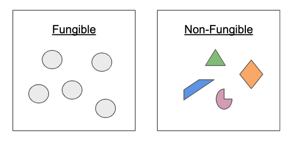
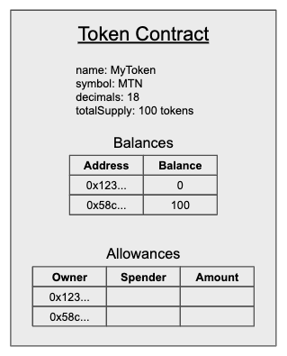
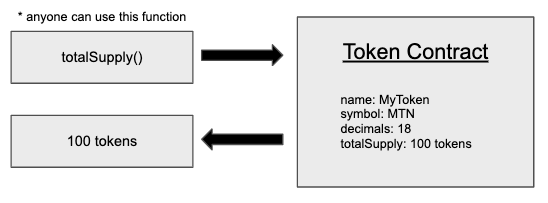
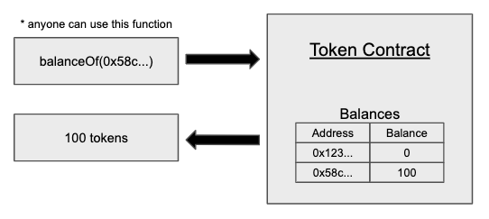
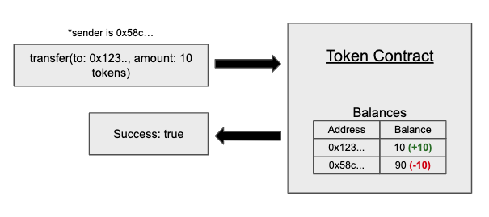
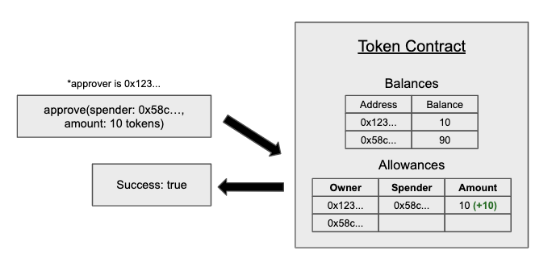
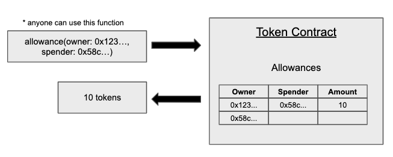
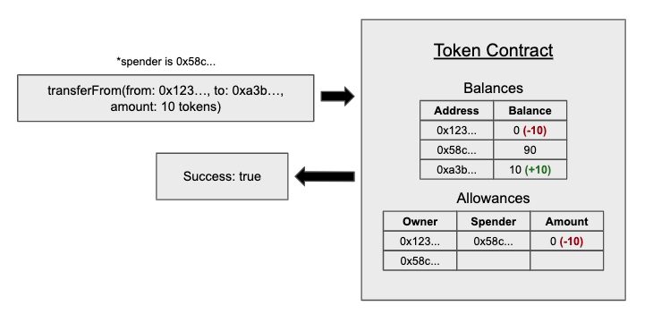
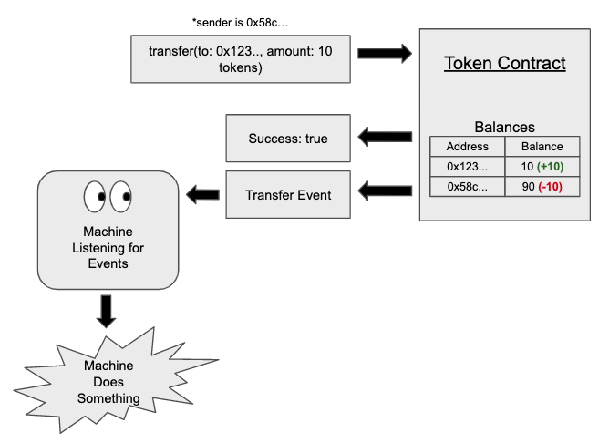

# A Straightforward Guide to ERC20 Tokens

## Summary

A token can be defined as something that serves as a visible or tangible representation of something else. An example of this could be arcade tokens, these pieces of metal are the physical representation of the amount of games that a person is able to play. However, unlike arcade tokens, tokens built on top of Ethereum are entirely virtual, but can still have representational value assigned to them in the same way. ERC20 tokens are by far the most used token on Ethereum and this guide will break down the ERC20 standard as well as what it means for something to be an ERC20 token.

## The Importance of Standards

When a large group of people are trying to come together to build something, it  is important that there be a community standard so that all builders are able to format their work. For example, every country has a standard for which side of the road cars are supposed to drive on. As a result, car manufacturers must build cars that have steering wheels that are compatible with local standards. In the same way with Ethereum tokens, a standard was needed to simplify the experience of creating and working with tokens. If no one followed a standard and each team had their own way of building tokens with different functionality then every wallet, exchange, and smart contract would need to write code specifically for every token. The ERC20 standard is a specification that makes it easy to add ERC20 compliant tokens to a service or smart contract.

## Fungibility and Divisibility of ERC20s

ERC20 tokens are fungible in nature, meaning that there isn’t a distinction between individual tokens. For example, if I have 100 metal marbles in my hand that are all the same size and color, it doesn’t matter which one I give you. In the same way, if I have 100 of the same ERC20 token, it doesn’t matter which one I give you. This contrasts with ERC721 tokens which are non-fungible tokens (NFTs) such as CryptoKitties.

In addition, ERC20s can be thought of as the most simple unit of account and can be used for a wide range of things including currency, rewards points, debt slips, interest accruing bonds, and much more. They are also highly divisible and can be sent in extremely small increments.

## The ERC20 Standard

The standard is made up of six required functions, two required events, and three optional properties. To begin with, it is important to note that the token contract is in charge of maintaining a list of addresses and associated balances as well as allowances. Allowances are used to allow different addresses to spend the tokens from your balance on your behalf.

Let’s use the token contract below as an example of a standard ERC20 token contract that implements all the requirements as well as the optional properties.  We can currently see that there is a total supply of 100 tokens and are all owned by a single address. In addition, there haven’t been any allowances set. 

### Optional Properties

Even though they are optional, most ERC20 tokens implement these properties to give their token more descriptive attributes.
* **name**
* **symbol** 
* **decimals** - The number of  decimals determines how divisible the token is. The most common is 18 decimals which means that for every one token the smallest divisible amount is 1x10^-18.

### Required Functions

* **totalSupply** - The totalSupply function returns what the current supply of tokens are for the contract. In this case the total supply is 100 tokens.

* **balanceOf** - If someone calls the balanceOf function with a specific address, it will return the token balance for that address. In this example, balanceOf is being called with 0x58c... and returns 100 tokens.

* **transfer** - The transfer function will only work if the amount specified is less than or equal to their balance. We can see in the example below that the transfer simply decreases the sender’s balance by 10 and increases the recipient's balance by 10. Once complete, the function returns a true value to show that the transfer was successful.

* **approve** - If an address has a balance, then it can use the approve function to allow a specific amount of it’s balance to be spent by another address. Below, address 0x123... is allowing 0x58c... to spend 10 of its tokens. Similar to transfer, the function returns a true value to show that the approval was successful. Note that this function doesn’t affect the balances directly, only the allowances.

* **allowance** - The allowance function is used to see how much an address is allowed to spend from another address. We can confirm that since the approve function has already been called and updated the allowance, that the current allowance for 0x58c... to spend from 0x123... is 10 tokens. 

* **transferFrom** - The transferFrom function is used when an address with an allowance wants to transfer the balance from one account to another. So 0x58c... can now move its allotted 10 tokens to 0xa3b... by specifying the account they want to transfer from, the to address, and how much. Since 0x58c… has a valid allowance of 10 tokens from 0x123... the transaction is valid and the 10 tokens are sent to 0xa3b....

### Required Events

Events in Ethereum are usually triggered when a transaction changes a contract’s state. They are important because they are able to provide information to things that are external to the Ethereum blockchain, which can then trigger other external things to happen. In ERC20 contracts, an event is fired when either the Balances or Allowances are updated.

* **Transfer** - The transfer event is fired when someone either successfully uses the transfer or transferFrom functions. It will give you the address of both the recipient and the sender as well as the amount of tokens that was sent in the transaction. 
* **Approval** - The approval event is fired when the approve function is successfully called and will return the owner, spender, and the approved amount.

## Additional Features for ERC20 Tokens

In addition to the required functions, there are additional features that ERC20 token contracts can add. The two primary ones are mintable and burnable tokens. Mintable tokens have a minting function that allows for the creation of additional tokens, meaning the total supply is not fixed. The minting functions are usually only able to be called by a specific set of privileged addresses. While burnable tokens are the opposite in that they can be burned and the supply can be reduced. It is also possible to have a contract that includes both minting and burning functions. 

## Resources

* [EIP20 ETH Github](https://github.com/ethereum/EIPs/blob/master/EIPS/eip-20.md)
* [A Guide to Events and Logs in Ethereum Smart Contracts](https://consensys.net/blog/blockchain-development/guide-to-events-and-logs-in-ethereum-smart-contracts/)